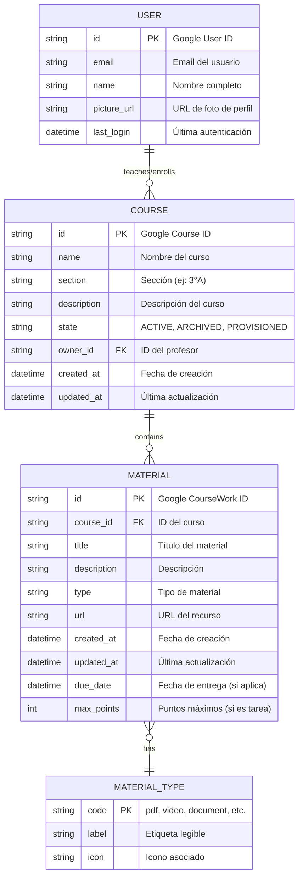
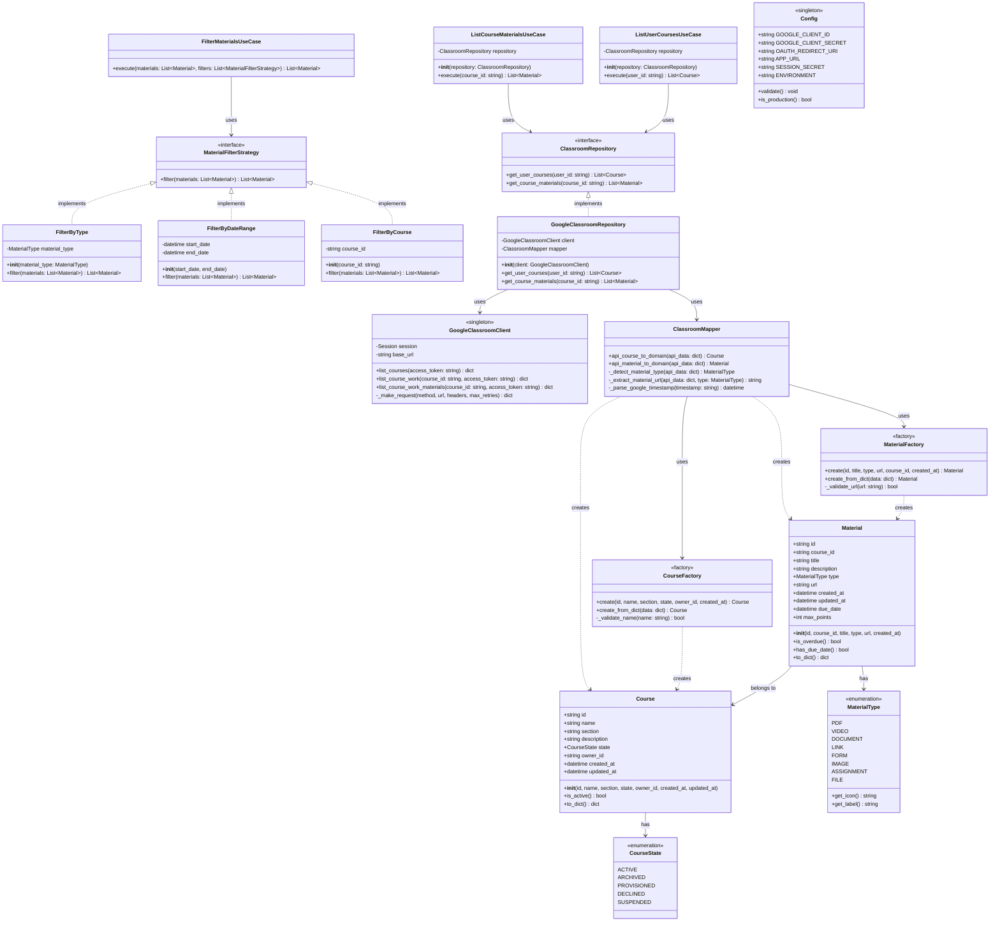
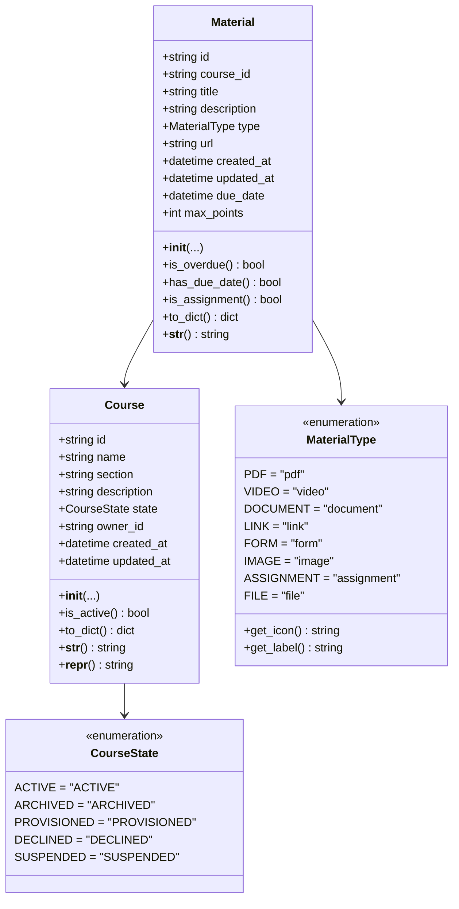
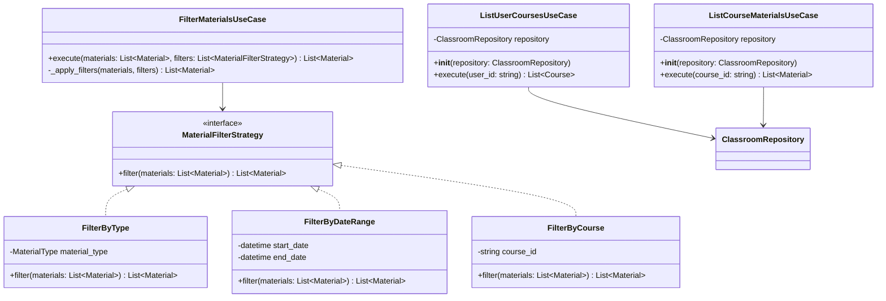
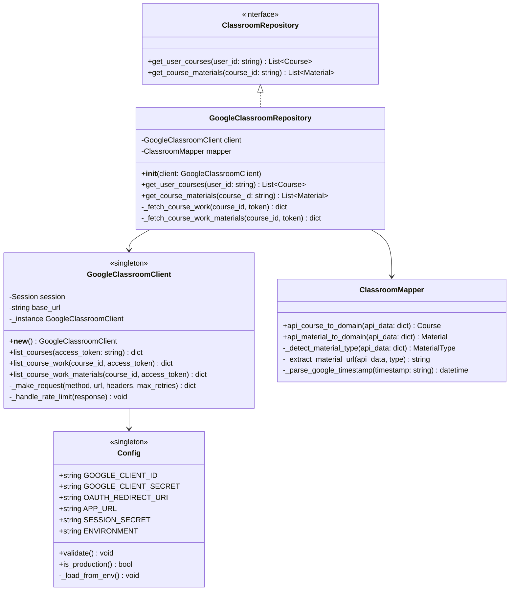
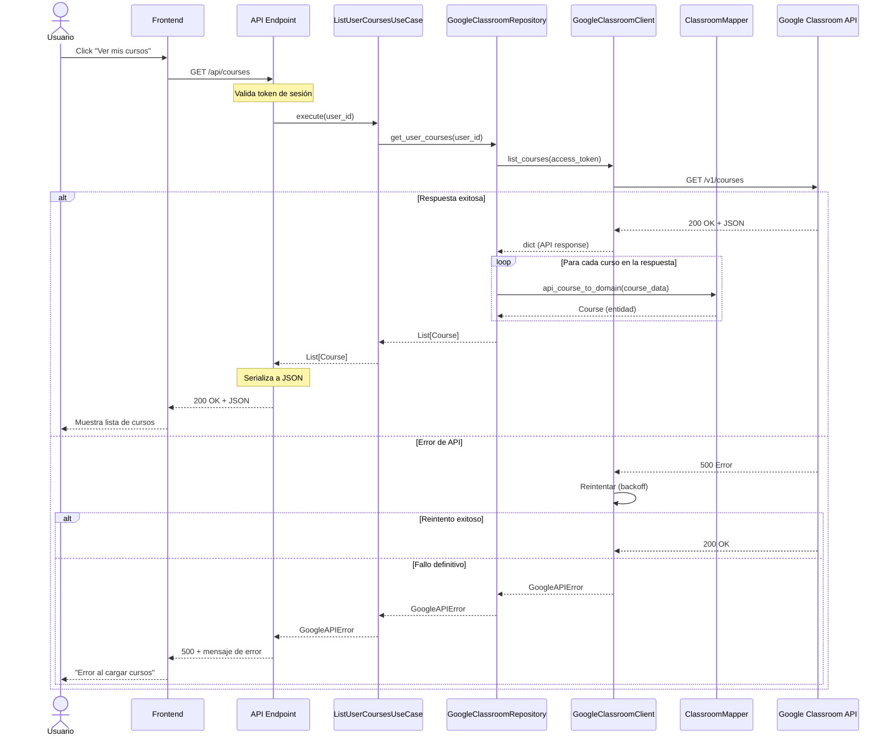
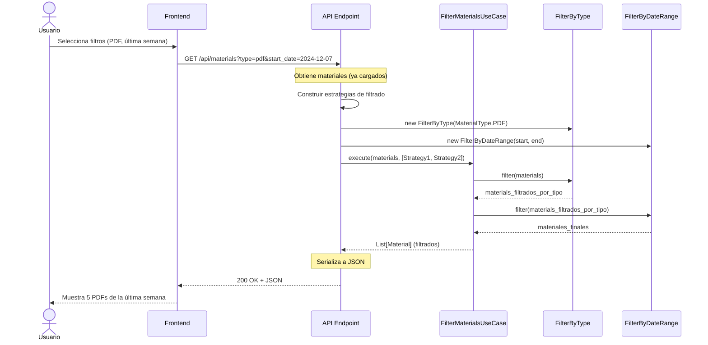

# 📊 Modelado de Datos y Clases — Classroom Explorer

> **Versión**: 1.0  
> **Fecha**: 2024-12-14  
> **Autor**: Equipo de Desarrollo  
> **Estado**: 📝 En Revisión

---

## 📑 Índice

1. [Modelo de Datos Lógico](#1-modelo-de-datos-lógico)
2. [Diagrama de Clases del Backend](#2-diagrama-de-clases-del-backend)
3. [Diccionario de Datos](#3-diccionario-de-datos)

---

## 1. Modelo de Datos Lógico

### 1.1 Contexto Importante

```
⚠️ NOTA CRÍTICA: Este proyecto NO tiene base de datos propia.

• Los datos se leen directamente de Google Classroom API
• No hay persistencia local (por ahora)
• El modelo lógico representa las ENTIDADES DE DOMINIO, no tablas SQL

POR QUÉ SÍ definir un modelo lógico:
✅ Clarifica qué datos manejamos
✅ Define la estructura de las entidades de dominio (POO)
✅ Facilita agregar persistencia en el futuro (Supabase)
✅ Documenta las relaciones entre entidades
```

---

### 1.2 Diagrama Entidad-Relación (DER)



---

### 1.3 Descripción de Entidades

#### 🧑 **USER (Usuario)**

```
DESCRIPCIÓN:
Representa un usuario de Google Classroom (profesor o estudiante).

FUENTE DE DATOS:
• Google OAuth 2.0 (perfil del usuario)
• Google Classroom API (roles)

CICLO DE VIDA:
• Se crea al hacer login por primera vez
• Se actualiza en cada autenticación
• No se persiste localmente (por ahora)

RELACIONES:
• Un USER puede tener múltiples COURSES (como profesor o estudiante)
```

| Atributo | Tipo | Obligatorio | Descripción |
|----------|------|-------------|-------------|
| `id` | string | ✅ | ID único de Google (sub del JWT) |
| `email` | string | ✅ | Email de Google |
| `name` | string | ✅ | Nombre completo |
| `picture_url` | string | ❌ | URL de la foto de perfil |
| `last_login` | datetime | ✅ | Timestamp de última autenticación |

---

#### 📚 **COURSE (Curso)**

```
DESCRIPCIÓN:
Representa un curso de Google Classroom.

FUENTE DE DATOS:
• Google Classroom API: courses.list

CICLO DE VIDA:
• Se obtiene de Google API en cada request
• No se persiste localmente
• Se cachea en memoria durante la sesión (5 min)

RELACIONES:
• Un COURSE pertenece a un USER (owner)
• Un COURSE contiene múltiples MATERIALS
```

| Atributo | Tipo | Obligatorio | Descripción |
|----------|------|-------------|-------------|
| `id` | string | ✅ | ID único de Google Classroom |
| `name` | string | ✅ | Nombre del curso (ej: "Matemáticas 3°A") |
| `section` | string | ❌ | Sección o división |
| `description` | string | ❌ | Descripción del curso |
| `state` | string | ✅ | ACTIVE, ARCHIVED, PROVISIONED, DECLINED, SUSPENDED |
| `owner_id` | string | ✅ | ID del profesor propietario |
| `created_at` | datetime | ✅ | Fecha de creación en Classroom |
| `updated_at` | datetime | ✅ | Última actualización |

**Reglas de Negocio:**
- ✅ Solo cursos con `state = ACTIVE` se muestran por defecto
- ✅ El `name` es obligatorio y debe tener al menos 3 caracteres
- ✅ Un curso sin materiales es válido (curso nuevo)

---

#### 📄 **MATERIAL (Material)**

```
DESCRIPCIÓN:
Representa un material/recurso de un curso (tarea, archivo, video, link, etc.).

FUENTE DE DATOS:
• Google Classroom API: courses.courseWork.list
• Google Classroom API: courses.courseWorkMaterials.list

CICLO DE VIDA:
• Se obtiene de Google API al seleccionar un curso
• No se persiste localmente
• Se cachea en memoria durante la sesión

RELACIONES:
• Un MATERIAL pertenece a un COURSE
• Un MATERIAL tiene un MATERIAL_TYPE
```

| Atributo | Tipo | Obligatorio | Descripción |
|----------|------|-------------|-------------|
| `id` | string | ✅ | ID único de Google Classroom |
| `course_id` | string | ✅ | ID del curso al que pertenece |
| `title` | string | ✅ | Título del material |
| `description` | string | ❌ | Descripción detallada |
| `type` | string | ✅ | Tipo: pdf, video, document, link, form, etc. |
| `url` | string | ✅ | URL para abrir el recurso |
| `created_at` | datetime | ✅ | Fecha de creación |
| `updated_at` | datetime | ✅ | Última actualización |
| `due_date` | datetime | ❌ | Fecha de entrega (solo si es tarea) |
| `max_points` | int | ❌ | Puntos máximos (solo si es tarea) |

**Reglas de Negocio:**
- ✅ El `title` es obligatorio
- ✅ El `url` debe ser una URL válida (http/https)
- ✅ El `type` debe ser uno de los valores del enum MaterialType
- ✅ Si `due_date` existe, debe ser posterior a `created_at`

---

#### 🏷️ **MATERIAL_TYPE (Tipo de Material)**

```
DESCRIPCIÓN:
Catálogo de tipos de materiales soportados.

FUENTE DE DATOS:
• Definido en código (enum)
• No viene de Google API

CICLO DE VIDA:
• Valores fijos en el código
• Se usa para clasificar materiales
```

| Código | Etiqueta | Icono | Descripción |
|--------|----------|-------|-------------|
| `pdf` | PDF | 📄 | Documento PDF |
| `video` | Video | 🎥 | Video (YouTube, Drive) |
| `document` | Documento | 📝 | Google Docs, Word, etc. |
| `link` | Enlace | 🔗 | URL externa |
| `form` | Formulario | 📋 | Google Forms |
| `image` | Imagen | 🖼️ | JPG, PNG, GIF |
| `assignment` | Tarea | ✏️ | Tarea con entrega |
| `file` | Archivo | 📎 | Otro tipo de archivo |

---

### 1.4 Relaciones y Cardinalidad

```
┌─────────────────────────────────────────────────────────────────┐
│                    RELACIONES ENTRE ENTIDADES                   │
└─────────────────────────────────────────────────────────────────┘

1. USER ──< COURSE (1:N)
   ────────────────────────────────────────────────────────────
   • Un usuario puede tener múltiples cursos
   • Un curso pertenece a un solo usuario (owner)
   
   Implementación:
   • Course.owner_id → User.id (Foreign Key conceptual)

2. COURSE ──< MATERIAL (1:N)
   ────────────────────────────────────────────────────────────
   • Un curso puede tener múltiples materiales
   • Un material pertenece a un solo curso
   
   Implementación:
   • Material.course_id → Course.id (Foreign Key conceptual)

3. MATERIAL >── MATERIAL_TYPE (N:1)
   ────────────────────────────────────────────────────────────
   • Múltiples materiales pueden tener el mismo tipo
   • Un material tiene un solo tipo
   
   Implementación:
   • Material.type → MaterialType.code (Enum)
```

---

### 1.5 Modelo Lógico vs. Modelo Físico

```
┌─────────────────────────────────────────────────────────────────┐
│  IMPORTANTE: Este es el MODELO LÓGICO (conceptual)              │
│  ─────────────────────────────────────────────────────────────  │
│  • Define QUÉ datos manejamos                                   │
│  • Define CÓMO se relacionan                                    │
│  • NO define tablas SQL (no hay DB propia)                      │
│                                                                 │
│  Si en el futuro agregamos Supabase:                            │
│  • Este modelo se convierte en el diseño de tablas              │
│  • Agregamos índices, constraints, triggers                     │
│  • Por ahora, solo guía nuestras entidades de dominio           │
└─────────────────────────────────────────────────────────────────┘
```

---

## 2. Diagrama de Clases del Backend

### 2.1 Arquitectura de Clases Completa



---

### 2.2 Diagrama de Clases por Capa

#### 📦 Domain Layer (Núcleo)



**Características Clave:**
- ✅ **Sin dependencias externas**: Solo Python estándar
- ✅ **Inmutables**: Usar `@dataclass(frozen=True)` cuando sea posible
- ✅ **Validaciones**: En `__post_init__` o en Factory
- ✅ **Métodos de negocio**: `is_active()`, `is_overdue()`, etc.

---

#### ⚙️ Application Layer (Casos de Uso)



**Características Clave:**
- ✅ **Un caso de uso = Una acción del usuario**
- ✅ **Reciben dependencias por constructor** (DI)
- ✅ **Método `execute()`** como punto de entrada
- ✅ **Sin lógica de infraestructura** (HTTP, DB, etc.)

---

#### 🔧 Infrastructure Layer (Adaptadores)



**Características Clave:**
- ✅ **Implementa interfaces del Domain**
- ✅ **Conoce detalles de Google API**
- ✅ **Maneja errores de red**
- ✅ **Convierte formatos externos → Domain**

---

### 2.3 Diagrama de Secuencia: Listar Cursos



---

### 2.4 Diagrama de Secuencia: Filtrar Materiales



---

## 3. Diccionario de Datos

### 3.1 Entidad: Course

| Atributo | Tipo Python | Tipo Lógico | Nullable | Default | Validación |
|----------|-------------|-------------|----------|---------|------------|
| `id` | `str` | string(255) | ❌ | - | Regex: `^[0-9]+$` |
| `name` | `str` | string(500) | ❌ | - | len >= 3 |
| `section` | `str \| None` | string(100) | ✅ | None | - |
| `description` | `str \| None` | text | ✅ | None | - |
| `state` | `CourseState` | enum | ❌ | ACTIVE | Enum values |
| `owner_id` | `str` | string(255) | ❌ | - | Regex: `^[0-9]+$` |
| `created_at` | `datetime` | timestamp | ❌ | - | - |
| `updated_at` | `datetime` | timestamp | ❌ | - | >= created_at |

**Índices Recomendados (si se persiste):**
- PRIMARY KEY: `id`
- INDEX: `owner_id`
- INDEX: `state`

---

### 3.2 Entidad: Material

| Atributo | Tipo Python | Tipo Lógico | Nullable | Default | Validación |
|----------|-------------|-------------|----------|---------|------------|
| `id` | `str` | string(255) | ❌ | - | Regex: `^[0-9]+$` |
| `course_id` | `str` | string(255) | ❌ | - | FK a Course.id |
| `title` | `str` | string(500) | ❌ | - | len >= 1 |
| `description` | `str \| None` | text | ✅ | None | - |
| `type` | `MaterialType` | enum | ❌ | - | Enum values |
| `url` | `str` | string(2048) | ❌ | - | Regex: `^https?://` |
| `created_at` | `datetime` | timestamp | ❌ | - | - |
| `updated_at` | `datetime` | timestamp | ❌ | - | >= created_at |
| `due_date` | `datetime \| None` | timestamp | ✅ | None | > created_at |
| `max_points` | `int \| None` | integer | ✅ | None | >= 0 |

**Índices Recomendados (si se persiste):**
- PRIMARY KEY: `id`
- INDEX: `course_id`
- INDEX: `type`
- INDEX: `created_at`

---

### 3.3 Enum: MaterialType

| Valor | Código | Descripción | Icono | Color Sugerido |
|-------|--------|-------------|-------|----------------|
| PDF | `"pdf"` | Documento PDF | 📄 | #E74C3C (rojo) |
| VIDEO | `"video"` | Video (YouTube, Drive) | 🎥 | #9B59B6 (púrpura) |
| DOCUMENT | `"document"` | Google Docs, Word | 📝 | #3498DB (azul) |
| LINK | `"link"` | Enlace externo | 🔗 | #1ABC9C (turquesa) |
| FORM | `"form"` | Google Forms | 📋 | #F39C12 (naranja) |
| IMAGE | `"image"` | JPG, PNG, GIF | 🖼️ | #E67E22 (naranja oscuro) |
| ASSIGNMENT | `"assignment"` | Tarea con entrega | ✏️ | #2ECC71 (verde) |
| FILE | `"file"` | Otro archivo | 📎 | #95A5A6 (gris) |

---

### 3.4 Enum: CourseState

| Valor | Código | Descripción |
|-------|--------|-------------|
| ACTIVE | `"ACTIVE"` | Curso activo y visible |
| ARCHIVED | `"ARCHIVED"` | Curso archivado (no visible por defecto) |
| PROVISIONED | `"PROVISIONED"` | Curso creado pero no activado |
| DECLINED | `"DECLINED"` | Invitación rechazada |
| SUSPENDED | `"SUSPENDED"` | Curso suspendido |

---

## 📎 Resumen Ejecutivo

### Decisiones de Modelado

| Decisión | Justificación |
|----------|---------------|
| **No persistencia local** | Datos vienen de Google API en tiempo real |
| **Modelo lógico definido** | Facilita agregar DB en el futuro |
| **Entidades inmutables** | Usar `@dataclass(frozen=True)` para seguridad |
| **Enums para tipos** | Evita strings mágicos, autocomplete en IDE |
| **Validaciones en Factory** | Centraliza reglas de creación |

### Próximo Paso

Una vez aprobado este documento, pasaremos a:
- **Parte C**: Diagramas de componentes y mapa de endpoints

---

## ✅ Checklist de Aprobación

- [ ] Modelo de datos lógico revisado
- [ ] Entidades y relaciones claras
- [ ] Diagrama de clases completo
- [ ] Diagramas de secuencia entendidos
- [ ] Diccionario de datos aprobado
- [ ] Listo para ver mapa de endpoints
