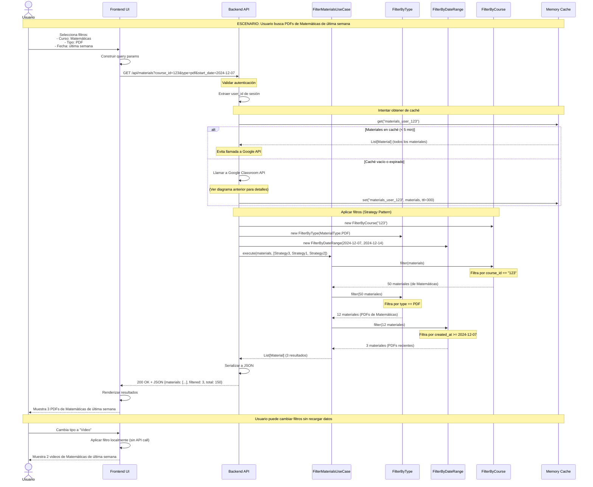
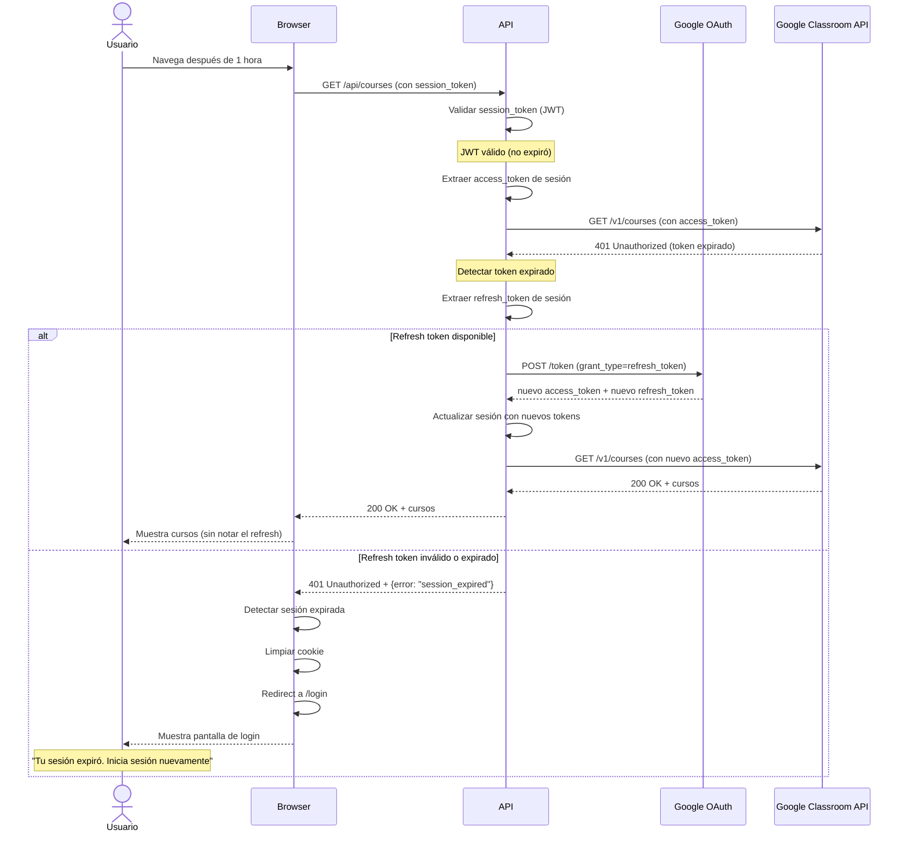
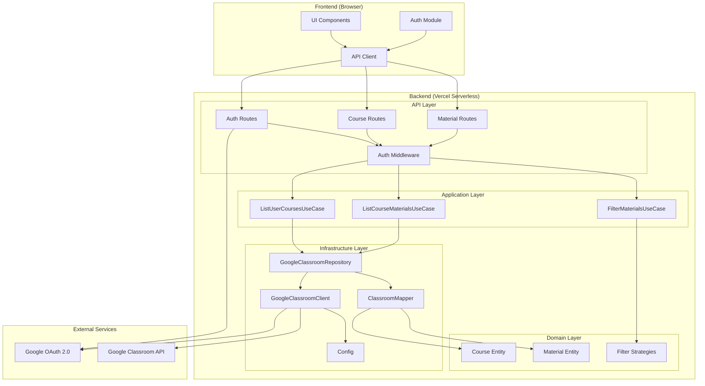

# 🔌 API y Dinámica del Sistema — Classroom Explorer

> **Versión**: 1.0  
> **Fecha**: 2024-12-14  
> **Autor**: Equipo de Desarrollo  
> **Estado**: 📝 En Revisión

---

## 📑 Índice

1. [Mapa de Endpoints](#1-mapa-de-endpoints)
2. [Diagramas de Secuencia](#2-diagramas-de-secuencia)
3. [Seguridad de Diseño](#3-seguridad-de-diseño)
4. [Especificaciones de API](#4-especificaciones-de-api)

---

## 1. Mapa de Endpoints

### 1.1 Arquitectura de API

```
┌─────────────────────────────────────────────────────────────────┐
│                    ESTRUCTURA DE API REST                       │
├─────────────────────────────────────────────────────────────────┤
│                                                                 │
│  Base URL (Local):     http://localhost:3000/api               │
│  Base URL (Producción): https://classroom-explorer.vercel.app/api │
│                                                                 │
│  Autenticación: Bearer Token (JWT) en header Authorization     │
│  Content-Type: application/json                                │
│  Charset: UTF-8                                                │
│                                                                 │
└─────────────────────────────────────────────────────────────────┘
```

---

### 1.2 Tabla de Endpoints con Trazabilidad

| Método | Endpoint | Descripción | Caso de Uso | Historia de Usuario | Requisito |
|--------|----------|-------------|-------------|---------------------|-----------|
| **POST** | `/api/auth/login` | Inicia flujo OAuth 2.0 | CU-001 | HU-001 | RF-M01 |
| **GET** | `/api/auth/callback` | Callback de Google OAuth | CU-001 | HU-001 | RF-M01 |
| **POST** | `/api/auth/logout` | Cierra sesión del usuario | CU-006 | HU-007 | RF-M08 |
| **GET** | `/api/auth/me` | Obtiene datos del usuario autenticado | - | - | - |
| **GET** | `/api/courses` | Lista cursos del usuario | CU-002 | HU-002 | RF-M02 |
| **GET** | `/api/courses/{id}` | Obtiene detalles de un curso | CU-002 | HU-002 | RF-M02 |
| **GET** | `/api/courses/{id}/materials` | Lista materiales de un curso | CU-003 | HU-003 | RF-M03 |
| **GET** | `/api/materials` | Lista todos los materiales (con filtros) | CU-004 | HU-006 | RF-M07, RF-S01, RF-S02 |
| **GET** | `/api/health` | Health check del servicio | - | - | - |

---

### 1.3 Detalle de Endpoints

#### 🔐 **POST /api/auth/login**

```
╔══════════════════════════════════════════════════════════════════╗
║  ENDPOINT: POST /api/auth/login                                  ║
╠══════════════════════════════════════════════════════════════════╣
║  DESCRIPCIÓN: Inicia el flujo de autenticación OAuth 2.0         ║
║  CASO DE USO: CU-001 (Iniciar Sesión con Google)                ║
║  HISTORIA DE USUARIO: HU-001                                     ║
║  REQUISITO: RF-M01                                               ║
╠══════════════════════════════════════════════════════════════════╣
║  REQUEST:                                                        ║
╠══════════════════════════════════════════════════════════════════╣
║  Method: POST                                                    ║
║  Headers: Content-Type: application/json                        ║
║  Body: {}  (vacío)                                               ║
╠══════════════════════════════════════════════════════════════════╣
║  RESPONSE (200 OK):                                              ║
╠══════════════════════════════════════════════════════════════════╣
║  {                                                               ║
║    "auth_url": "https://accounts.google.com/o/oauth2/v2/auth?..." ║
║  }                                                               ║
╠══════════════════════════════════════════════════════════════════╣
║  ERRORES:                                                        ║
╠══════════════════════════════════════════════════════════════════╣
║  500: Error al generar URL de autenticación                      ║
╚══════════════════════════════════════════════════════════════════╝
```

**Ejemplo de Request:**
```bash
curl -X POST http://localhost:3000/api/auth/login \
  -H "Content-Type: application/json"
```

**Ejemplo de Response:**
```json
{
  "auth_url": "https://accounts.google.com/o/oauth2/v2/auth?client_id=123456&redirect_uri=http://localhost:3000/api/auth/callback&response_type=code&scope=openid%20email%20profile%20https://www.googleapis.com/auth/classroom.courses.readonly&state=abc123&access_type=offline"
}
```

---

#### 🔐 **GET /api/auth/callback**

```
╔══════════════════════════════════════════════════════════════════╗
║  ENDPOINT: GET /api/auth/callback                                ║
╠══════════════════════════════════════════════════════════════════╣
║  DESCRIPCIÓN: Recibe el código de autorización de Google         ║
║  CASO DE USO: CU-001 (Iniciar Sesión con Google)                ║
║  HISTORIA DE USUARIO: HU-001                                     ║
║  REQUISITO: RF-M01                                               ║
╠══════════════════════════════════════════════════════════════════╣
║  REQUEST:                                                        ║
╠══════════════════════════════════════════════════════════════════╣
║  Method: GET                                                     ║
║  Query Params:                                                   ║
║    - code: string (código de autorización)                       ║
║    - state: string (validación CSRF)                             ║
╠══════════════════════════════════════════════════════════════════╣
║  RESPONSE (302 Redirect):                                        ║
╠══════════════════════════════════════════════════════════════════╣
║  Location: /                                                     ║
║  Set-Cookie: session_token=<JWT>; HttpOnly; Secure               ║
╠══════════════════════════════════════════════════════════════════╣
║  ERRORES:                                                        ║
╠══════════════════════════════════════════════════════════════════╣
║  400: Código inválido o state no coincide                        ║
║  500: Error al intercambiar código por token                     ║
╚══════════════════════════════════════════════════════════════════╝
```

**Flujo:**
1. Google redirige a este endpoint con `code` y `state`
2. Backend valida `state` (prevención CSRF)
3. Backend intercambia `code` por `access_token` y `refresh_token`
4. Backend crea sesión y establece cookie HttpOnly
5. Redirige al usuario a la página principal

---

#### 🔐 **POST /api/auth/logout**

```
╔══════════════════════════════════════════════════════════════════╗
║  ENDPOINT: POST /api/auth/logout                                 ║
╠══════════════════════════════════════════════════════════════════╣
║  DESCRIPCIÓN: Cierra la sesión del usuario                       ║
║  CASO DE USO: CU-006 (Cerrar Sesión)                            ║
║  HISTORIA DE USUARIO: HU-007                                     ║
║  REQUISITO: RF-M08                                               ║
╠══════════════════════════════════════════════════════════════════╣
║  REQUEST:                                                        ║
╠══════════════════════════════════════════════════════════════════╣
║  Method: POST                                                    ║
║  Headers:                                                        ║
║    - Cookie: session_token=<JWT>                                 ║
╠══════════════════════════════════════════════════════════════════╣
║  RESPONSE (200 OK):                                              ║
╠══════════════════════════════════════════════════════════════════╣
║  {                                                               ║
║    "message": "Sesión cerrada exitosamente"                      ║
║  }                                                               ║
║  Set-Cookie: session_token=; Max-Age=0                           ║
╠══════════════════════════════════════════════════════════════════╣
║  ERRORES:                                                        ║
╠══════════════════════════════════════════════════════════════════╣
║  401: No autenticado                                             ║
╚══════════════════════════════════════════════════════════════════╝
```

**Ejemplo de Request:**
```bash
curl -X POST http://localhost:3000/api/auth/logout \
  -H "Cookie: session_token=eyJhbGc..."
```

---

#### 📚 **GET /api/courses**

```
╔══════════════════════════════════════════════════════════════════╗
║  ENDPOINT: GET /api/courses                                      ║
╠══════════════════════════════════════════════════════════════════╣
║  DESCRIPCIÓN: Lista todos los cursos del usuario autenticado     ║
║  CASO DE USO: CU-002 (Listar Cursos del Usuario)                ║
║  HISTORIA DE USUARIO: HU-002                                     ║
║  REQUISITO: RF-M02                                               ║
╠══════════════════════════════════════════════════════════════════╣
║  REQUEST:                                                        ║
╠══════════════════════════════════════════════════════════════════╣
║  Method: GET                                                     ║
║  Headers:                                                        ║
║    - Cookie: session_token=<JWT>                                 ║
║  Query Params (opcionales):                                      ║
║    - state: string (ACTIVE, ARCHIVED, ALL) [default: ACTIVE]     ║
╠══════════════════════════════════════════════════════════════════╣
║  RESPONSE (200 OK):                                              ║
╠══════════════════════════════════════════════════════════════════╣
║  {                                                               ║
║    "courses": [                                                  ║
║      {                                                           ║
║        "id": "123456",                                           ║
║        "name": "Matemáticas 3°A",                                ║
║        "section": "Turno Mañana",                                ║
║        "description": "Curso de matemáticas...",                 ║
║        "state": "ACTIVE",                                        ║
║        "owner_id": "987654",                                     ║
║        "created_at": "2024-01-15T10:00:00Z",                     ║
║        "updated_at": "2024-12-01T15:30:00Z"                      ║
║      }                                                           ║
║    ],                                                            ║
║    "total": 5                                                    ║
║  }                                                               ║
╠══════════════════════════════════════════════════════════════════╣
║  ERRORES:                                                        ║
╠══════════════════════════════════════════════════════════════════╣
║  401: No autenticado                                             ║
║  500: Error al obtener cursos de Google API                      ║
╚══════════════════════════════════════════════════════════════════╝
```

**Ejemplo de Request:**
```bash
curl -X GET "http://localhost:3000/api/courses?state=ACTIVE" \
  -H "Cookie: session_token=eyJhbGc..."
```

---

#### 📄 **GET /api/courses/{id}/materials**

```
╔══════════════════════════════════════════════════════════════════╗
║  ENDPOINT: GET /api/courses/{id}/materials                       ║
╠══════════════════════════════════════════════════════════════════╣
║  DESCRIPCIÓN: Lista materiales de un curso específico            ║
║  CASO DE USO: CU-003 (Listar Materiales de un Curso)            ║
║  HISTORIA DE USUARIO: HU-003                                     ║
║  REQUISITO: RF-M03                                               ║
╠══════════════════════════════════════════════════════════════════╣
║  REQUEST:                                                        ║
╠══════════════════════════════════════════════════════════════════╣
║  Method: GET                                                     ║
║  Headers:                                                        ║
║    - Cookie: session_token=<JWT>                                 ║
║  Path Params:                                                    ║
║    - id: string (ID del curso)                                   ║
╠══════════════════════════════════════════════════════════════════╣
║  RESPONSE (200 OK):                                              ║
╠══════════════════════════════════════════════════════════════════╣
║  {                                                               ║
║    "materials": [                                                ║
║      {                                                           ║
║        "id": "789012",                                           ║
║        "course_id": "123456",                                    ║
║        "title": "Guía de Integrales",                            ║
║        "description": "Material de estudio...",                  ║
║        "type": "pdf",                                            ║
║        "url": "https://drive.google.com/file/d/...",             ║
║        "created_at": "2024-11-20T08:00:00Z",                     ║
║        "updated_at": "2024-11-20T08:00:00Z",                     ║
║        "due_date": null,                                         ║
║        "max_points": null                                        ║
║      }                                                           ║
║    ],                                                            ║
║    "total": 15,                                                  ║
║    "course": {                                                   ║
║      "id": "123456",                                             ║
║      "name": "Matemáticas 3°A"                                   ║
║    }                                                             ║
║  }                                                               ║
╠══════════════════════════════════════════════════════════════════╣
║  ERRORES:                                                        ║
╠══════════════════════════════════════════════════════════════════╣
║  401: No autenticado                                             ║
║  404: Curso no encontrado                                        ║
║  403: Sin permiso para ver este curso                            ║
║  500: Error al obtener materiales de Google API                  ║
╚══════════════════════════════════════════════════════════════════╝
```

**Ejemplo de Request:**
```bash
curl -X GET "http://localhost:3000/api/courses/123456/materials" \
  -H "Cookie: session_token=eyJhbGc..."
```

---

#### 🔍 **GET /api/materials**

```
╔══════════════════════════════════════════════════════════════════╗
║  ENDPOINT: GET /api/materials                                    ║
╠══════════════════════════════════════════════════════════════════╣
║  DESCRIPCIÓN: Lista materiales con filtros avanzados             ║
║  CASO DE USO: CU-004 (Filtrar Materiales)                       ║
║  HISTORIA DE USUARIO: HU-006                                     ║
║  REQUISITOS: RF-M07, RF-S01, RF-S02                              ║
╠══════════════════════════════════════════════════════════════════╣
║  REQUEST:                                                        ║
╠══════════════════════════════════════════════════════════════════╣
║  Method: GET                                                     ║
║  Headers:                                                        ║
║    - Cookie: session_token=<JWT>                                 ║
║  Query Params (todos opcionales):                                ║
║    - course_id: string (filtrar por curso)                       ║
║    - type: string (pdf, video, document, link, form, etc.)       ║
║    - start_date: ISO 8601 (ej: 2024-12-01T00:00:00Z)             ║
║    - end_date: ISO 8601                                          ║
║    - sort_by: string (title, created_at, type) [default: created_at] ║
║    - sort_order: string (asc, desc) [default: desc]              ║
╠══════════════════════════════════════════════════════════════════╣
║  RESPONSE (200 OK):                                              ║
╠══════════════════════════════════════════════════════════════════╣
║  {                                                               ║
║    "materials": [ /* array de materiales */ ],                   ║
║    "total": 42,                                                  ║
║    "filtered": 8,                                                ║
║    "filters_applied": {                                          ║
║      "type": "pdf",                                              ║
║      "start_date": "2024-12-01T00:00:00Z"                        ║
║    }                                                             ║
║  }                                                               ║
╠══════════════════════════════════════════════════════════════════╣
║  ERRORES:                                                        ║
╠══════════════════════════════════════════════════════════════════╣
║  401: No autenticado                                             ║
║  400: Parámetros de filtro inválidos                             ║
║  500: Error al obtener materiales                                ║
╚══════════════════════════════════════════════════════════════════╝
```

**Ejemplo de Request:**
```bash
curl -X GET "http://localhost:3000/api/materials?type=pdf&start_date=2024-12-01T00:00:00Z" \
  -H "Cookie: session_token=eyJhbGc..."
```

**Ejemplo de Response:**
```json
{
  "materials": [
    {
      "id": "789012",
      "course_id": "123456",
      "title": "Guía de Integrales",
      "type": "pdf",
      "url": "https://drive.google.com/file/d/...",
      "created_at": "2024-12-05T10:00:00Z"
    },
    {
      "id": "789013",
      "course_id": "123457",
      "title": "Ejercicios Resueltos",
      "type": "pdf",
      "url": "https://drive.google.com/file/d/...",
      "created_at": "2024-12-03T14:30:00Z"
    }
  ],
  "total": 150,
  "filtered": 2,
  "filters_applied": {
    "type": "pdf",
    "start_date": "2024-12-01T00:00:00Z"
  }
}
```

---

### 1.4 Matriz de Trazabilidad Completa

| Endpoint | CU | HU | RF | RNF |
|----------|----|----|----|----|
| `POST /api/auth/login` | CU-001 | HU-001 | RF-M01 | RNF-SEC01, RNF-SEC02 |
| `GET /api/auth/callback` | CU-001 | HU-001 | RF-M01 | RNF-SEC02, RNF-SEC03 |
| `POST /api/auth/logout` | CU-006 | HU-007 | RF-M08 | RNF-SEC04 |
| `GET /api/courses` | CU-002 | HU-002 | RF-M02 | RNF-PERF02, RNF-UX03 |
| `GET /api/courses/{id}` | CU-002 | HU-002 | RF-M02 | RNF-PERF02 |
| `GET /api/courses/{id}/materials` | CU-003 | HU-003 | RF-M03 | RNF-PERF01, RNF-PERF02 |
| `GET /api/materials` | CU-004 | HU-006 | RF-M07, RF-S01, RF-S02 | RNF-PERF04 |

---

## 2. Diagramas de Secuencia

### 2.1 Flujo Completo: Autenticación OAuth 2.0

```mermaid
sequenceDiagram
    actor Usuario
    participant Browser as Frontend (Browser)
    participant API as Backend API
    participant OAuth as Google OAuth
    participant Classroom as Google Classroom API
    
    Note over Usuario,Classroom: FASE 1: Inicio de Sesión
    
    Usuario->>Browser: Click "Iniciar con Google"
    Browser->>API: POST /api/auth/login
    
    API->>API: Generar state (CSRF token)
    API->>API: Construir auth_url con scopes
    API-->>Browser: 200 OK + auth_url
    
    Browser->>OAuth: Redirect a auth_url
    OAuth->>Usuario: Muestra pantalla de consentimiento
    Usuario->>OAuth: Selecciona cuenta y autoriza
    
    Note over Usuario,Classroom: FASE 2: Callback y Tokens
    
    OAuth->>Browser: Redirect a /api/auth/callback?code=ABC&state=XYZ
    Browser->>API: GET /api/auth/callback?code=ABC&state=XYZ
    
    API->>API: Validar state (prevenir CSRF)
    
    alt State válido
        API->>OAuth: POST /token (intercambiar code por tokens)
        OAuth-->>API: access_token + refresh_token + id_token
        
        API->>API: Decodificar id_token (JWT)
        API->>API: Extraer user_id, email, name
        
        API->>API: Crear sesión (JWT propio)
        API->>API: Guardar tokens en sesión (encriptados)
        
        API-->>Browser: 302 Redirect a /
        Note over API,Browser: Set-Cookie: session_token=<JWT>; HttpOnly; Secure
        
        Browser->>Browser: Guardar cookie
        Browser-->>Usuario: Muestra página principal
        
        Note over Usuario,Classroom: FASE 3: Primera Request Autenticada
        
        Usuario->>Browser: Página carga automáticamente
        Browser->>API: GET /api/courses (con cookie)
        
        API->>API: Validar session_token (JWT)
        API->>API: Extraer access_token de la sesión
        
        API->>Classroom: GET /v1/courses (con access_token)
        Classroom-->>API: 200 OK + lista de cursos
        
        API->>API: Mapear cursos a entidades de dominio
        API-->>Browser: 200 OK + JSON
        
        Browser-->>Usuario: Muestra lista de cursos
        
    else State inválido (ataque CSRF)
        API-->>Browser: 400 Bad Request
        Browser-->>Usuario: "Error de autenticación"
    end
```

---

### 2.2 Flujo Completo: Filtrado Avanzado de Materiales



---

### 2.3 Flujo de Error: Token Expirado con Refresh



---

### 2.4 Diagrama de Componentes



---

## 3. Seguridad de Diseño

### 3.1 Gestión de Secretos y API Keys

#### 🔐 Regla de Oro: Zero-Trust

```
┌─────────────────────────────────────────────────────────────────┐
│                    PRINCIPIO ZERO-TRUST                         │
│  ─────────────────────────────────────────────────────────────  │
│  NUNCA escribas credenciales reales en:                         │
│  ❌ Código fuente                                                │
│  ❌ Archivos de configuración versionados                        │
│  ❌ Comentarios                                                  │
│  ❌ Logs                                                         │
│  ❌ Mensajes de error al usuario                                 │
│                                                                 │
│  SIEMPRE usa:                                                   │
│  ✅ Variables de entorno (.env)                                  │
│  ✅ Servicios de gestión de secretos (Vercel Env Vars)          │
│  ✅ Placeholders en documentación (<TU_CLAVE_AQUI>)              │
└─────────────────────────────────────────────────────────────────┘
```

---

### 3.2 Arquitectura de Seguridad

```
┌─────────────────────────────────────────────────────────────────┐
│                    FLUJO DE CREDENCIALES                        │
└─────────────────────────────────────────────────────────────────┘

DESARROLLO LOCAL:
─────────────────────────────────────────────────────────────────
1. Desarrollador crea .env (nunca versionado)
2. Aplicación lee con os.getenv()
3. Config class valida al inicio
4. Si falta algo, falla rápido con mensaje claro

PRODUCCIÓN (Vercel):
─────────────────────────────────────────────────────────────────
1. Admin configura en Vercel Dashboard → Settings → Environment Variables
2. Vercel inyecta como variables de entorno en runtime
3. Aplicación lee con os.getenv() (mismo código)
4. Nunca se exponen al cliente (solo backend)
```

---

### 3.3 Variables de Entorno Requeridas

| Variable | Descripción | Ejemplo | Dónde se Usa | Sensibilidad |
|----------|-------------|---------|--------------|--------------|
| `GOOGLE_CLIENT_ID` | ID de cliente OAuth 2.0 | `123456-abc.apps.googleusercontent.com` | OAuth flow | 🟡 Pública (aparece en URLs) |
| `GOOGLE_CLIENT_SECRET` | Secret de cliente OAuth | `GOCSPX-abc123def456` | Token exchange | 🔴 CRÍTICA |
| `OAUTH_REDIRECT_URI` | URL de callback | `http://localhost:3000/api/auth/callback` | OAuth flow | 🟢 Pública |
| `APP_URL` | URL base de la app | `http://localhost:3000` | Redirects | 🟢 Pública |
| `SESSION_SECRET` | Secret para firmar JWTs | `<64 caracteres aleatorios>` | JWT signing | 🔴 CRÍTICA |
| `ENVIRONMENT` | Entorno de ejecución | `development` o `production` | Config | 🟢 Pública |

---

### 3.4 Implementación de Config Class

```python
# ═══════════════════════════════════════════════════════════════
# api/infrastructure/config.py
# ═══════════════════════════════════════════════════════════════
import os
from typing import Optional

class Config:
    """
    Configuración centralizada de la aplicación.
    
    POR QUÉ SÍ:
    • Todas las variables de entorno en un solo lugar
    • Validación al inicio (fail-fast)
    • Fácil de testear (mock de variables)
    • Documentación implícita de qué se necesita
    
    POR QUÉ NO hardcodear:
    • Las credenciales quedarían en Git (peligro)
    • No podríamos cambiar valores sin redeployar
    • Violaríamos el principio de 12-factor app
    """
    
    # ─────────────────────────────────────────────────────────
    # Google OAuth 2.0
    # ─────────────────────────────────────────────────────────
    GOOGLE_CLIENT_ID: str = os.getenv('GOOGLE_CLIENT_ID', '')
    GOOGLE_CLIENT_SECRET: str = os.getenv('GOOGLE_CLIENT_SECRET', '')
    OAUTH_REDIRECT_URI: str = os.getenv(
        'OAUTH_REDIRECT_URI',
        'http://localhost:3000/api/auth/callback'
    )
    
    # ─────────────────────────────────────────────────────────
    # Aplicación
    # ─────────────────────────────────────────────────────────
    APP_URL: str = os.getenv('APP_URL', 'http://localhost:3000')
    SESSION_SECRET: str = os.getenv('SESSION_SECRET', '')
    ENVIRONMENT: str = os.getenv('ENVIRONMENT', 'development')
    
    # ─────────────────────────────────────────────────────────
    # Google Classroom API
    # ─────────────────────────────────────────────────────────
    CLASSROOM_API_BASE_URL: str = 'https://classroom.googleapis.com/v1'
    OAUTH_SCOPES: list[str] = [
        'openid',
        'email',
        'profile',
        'https://www.googleapis.com/auth/classroom.courses.readonly',
        'https://www.googleapis.com/auth/classroom.coursework.me.readonly'
    ]
    
    @classmethod
    def validate(cls) -> None:
        """
        Valida que todas las variables críticas estén configuradas.
        Debe llamarse al inicio de la aplicación.
        
        Raises:
            ValueError: Si falta alguna variable crítica
        """
        errors: list[str] = []
        
        # Validar OAuth
        if not cls.GOOGLE_CLIENT_ID:
            errors.append("❌ GOOGLE_CLIENT_ID no está configurado")
        
        if not cls.GOOGLE_CLIENT_SECRET:
            errors.append("❌ GOOGLE_CLIENT_SECRET no está configurado")
        
        # Validar Session Secret (solo en producción)
        if cls.is_production() and not cls.SESSION_SECRET:
            errors.append("❌ SESSION_SECRET es obligatorio en producción")
        
        if cls.is_production() and len(cls.SESSION_SECRET) < 32:
            errors.append("❌ SESSION_SECRET debe tener al menos 32 caracteres")
        
        # Validar URLs
        if not cls.APP_URL.startswith('http'):
            errors.append(f"❌ APP_URL inválida: {cls.APP_URL}")
        
        if not cls.OAUTH_REDIRECT_URI.startswith('http'):
            errors.append(f"❌ OAUTH_REDIRECT_URI inválida: {cls.OAUTH_REDIRECT_URI}")
        
        if errors:
            error_message = "\n".join([
                "═" * 60,
                "ERROR DE CONFIGURACIÓN",
                "═" * 60,
                *errors,
                "═" * 60,
                "Revisa tu archivo .env o las variables de entorno de Vercel",
                "Consulta .env.example para ver el formato correcto"
            ])
            raise ValueError(error_message)
    
    @classmethod
    def is_production(cls) -> bool:
        """Verifica si estamos en producción."""
        return cls.ENVIRONMENT == 'production'
    
    @classmethod
    def is_development(cls) -> bool:
        """Verifica si estamos en desarrollo."""
        return cls.ENVIRONMENT == 'development'
    
    @classmethod
    def get_oauth_auth_url(cls, state: str) -> str:
        """
        Construye la URL de autenticación de Google.
        
        Args:
            state: Token CSRF para validar el callback
        
        Returns:
            URL completa para redirigir al usuario
        """
        from urllib.parse import urlencode
        
        params = {
            'client_id': cls.GOOGLE_CLIENT_ID,
            'redirect_uri': cls.OAUTH_REDIRECT_URI,
            'response_type': 'code',
            'scope': ' '.join(cls.OAUTH_SCOPES),
            'state': state,
            'access_type': 'offline',  # Para obtener refresh_token
            'prompt': 'consent'  # Forzar pantalla de consentimiento
        }
        
        return f"https://accounts.google.com/o/oauth2/v2/auth?{urlencode(params)}"
```

---

### 3.5 Uso de Config en la Aplicación

```python
# ═══════════════════════════════════════════════════════════════
# api/main.py (punto de entrada)
# ═══════════════════════════════════════════════════════════════
from api.infrastructure.config import Config

# ✅ VALIDAR AL INICIO (fail-fast)
try:
    Config.validate()
    print("✅ Configuración válida")
except ValueError as e:
    print(e)
    exit(1)  # Terminar si falta algo crítico

# Ahora podemos usar Config en toda la app
```

```python
# ═══════════════════════════════════════════════════════════════
# api/routes/auth.py
# ═══════════════════════════════════════════════════════════════
from api.infrastructure.config import Config

def login():
    """Endpoint: POST /api/auth/login"""
    state = generate_csrf_token()
    
    # ✅ Usar Config en lugar de hardcodear
    auth_url = Config.get_oauth_auth_url(state)
    
    return {"auth_url": auth_url}
```

---

### 3.6 Protección de Tokens en Runtime

#### 🔒 Almacenamiento Seguro de Tokens

```
┌─────────────────────────────────────────────────────────────────┐
│              DÓNDE GUARDAR TOKENS (Backend)                     │
├─────────────────────────────────────────────────────────────────┤
│                                                                 │
│  ✅ CORRECTO:                                                   │
│  • Cookies HttpOnly + Secure + SameSite                         │
│  • Sesión en memoria (con TTL)                                  │
│  • Encriptados con SESSION_SECRET                               │
│                                                                 │
│  ❌ INCORRECTO:                                                 │
│  • localStorage (vulnerable a XSS)                              │
│  • sessionStorage (vulnerable a XSS)                            │
│  • Cookies sin HttpOnly (accesibles desde JS)                   │
│  • Variables globales de JavaScript                             │
│                                                                 │
└─────────────────────────────────────────────────────────────────┘
```

#### Implementación de Sesión Segura

```python
# ═══════════════════════════════════════════════════════════════
# api/infrastructure/session.py
# ═══════════════════════════════════════════════════════════════
import jwt
from datetime import datetime, timedelta
from api.infrastructure.config import Config

class SessionManager:
    """
    Gestiona sesiones de usuario con JWT.
    
    POR QUÉ SÍ JWT:
    • Stateless (no necesitamos DB de sesiones)
    • Firmado (no se puede modificar)
    • Con expiración automática
    
    POR QUÉ NO guardar tokens de Google en JWT:
    • El JWT va en cookie (podría ser grande)
    • Mejor guardar solo user_id y obtener tokens de caché
    """
    
    @staticmethod
    def create_session(user_id: str, access_token: str, refresh_token: str) -> str:
        """
        Crea un JWT de sesión.
        
        Args:
            user_id: ID del usuario de Google
            access_token: Token de acceso de Google (se guarda encriptado)
            refresh_token: Token de refresh de Google
        
        Returns:
            JWT firmado
        """
        payload = {
            'user_id': user_id,
            'access_token': access_token,  # TODO: Encriptar
            'refresh_token': refresh_token,  # TODO: Encriptar
            'iat': datetime.utcnow(),
            'exp': datetime.utcnow() + timedelta(hours=24)
        }
        
        return jwt.encode(
            payload,
            Config.SESSION_SECRET,
            algorithm='HS256'
        )
    
    @staticmethod
    def validate_session(token: str) -> dict:
        """
        Valida y decodifica un JWT de sesión.
        
        Args:
            token: JWT de sesión
        
        Returns:
            Payload decodificado
        
        Raises:
            jwt.ExpiredSignatureError: Si el token expiró
            jwt.InvalidTokenError: Si el token es inválido
        """
        return jwt.decode(
            token,
            Config.SESSION_SECRET,
            algorithms=['HS256']
        )
```

---

### 3.7 Checklist de Seguridad

| ✅ | Práctica | Implementación | Archivo |
|----|----------|----------------|---------|
| ✅ | Variables de entorno | `.env` + `Config` class | `config.py` |
| ✅ | Validación al inicio | `Config.validate()` | `main.py` |
| ✅ | Secrets nunca en código | `os.getenv()` siempre | Todos |
| ✅ | `.env` en `.gitignore` | Desde día 1 | `.gitignore` |
| ✅ | `.env.example` con placeholders | Documentación | `.env.example` |
| ✅ | HTTPS en producción | Vercel automático | - |
| ✅ | Cookies HttpOnly + Secure | `Set-Cookie` flags | `auth.py` |
| ✅ | CSRF protection | `state` parameter | OAuth flow |
| ✅ | JWT firmado | `SESSION_SECRET` | `session.py` |
| ✅ | Tokens encriptados | TODO: Implementar | `session.py` |
| ✅ | Rate limiting | Backoff exponencial | `google_classroom_client.py` |
| ✅ | Logs sanitizados | No loguear tokens | Todos |

---

## 4. Especificaciones de API

### 4.1 Formato de Respuestas

#### Respuesta Exitosa (2xx)

```json
{
  "data": { /* payload */ },
  "meta": {
    "timestamp": "2024-12-14T01:57:40Z",
    "version": "1.0"
  }
}
```

#### Respuesta de Error (4xx, 5xx)

```json
{
  "error": {
    "code": "INVALID_TOKEN",
    "message": "El token de sesión es inválido o expiró",
    "details": {
      "reason": "jwt.ExpiredSignatureError"
    }
  },
  "meta": {
    "timestamp": "2024-12-14T01:57:40Z",
    "request_id": "abc123"
  }
}
```

---

### 4.2 Códigos de Estado HTTP

| Código | Significado | Cuándo Usarlo |
|--------|-------------|---------------|
| **200** | OK | Request exitoso con datos |
| **201** | Created | Recurso creado (no aplica en este proyecto) |
| **204** | No Content | Request exitoso sin datos (ej: logout) |
| **400** | Bad Request | Parámetros inválidos |
| **401** | Unauthorized | No autenticado o token inválido |
| **403** | Forbidden | Autenticado pero sin permisos |
| **404** | Not Found | Recurso no existe |
| **429** | Too Many Requests | Rate limit excedido |
| **500** | Internal Server Error | Error del servidor |
| **502** | Bad Gateway | Error de Google API |
| **503** | Service Unavailable | Servicio temporalmente no disponible |

---

### 4.3 Headers Requeridos

#### Request Headers

```
Authorization: Bearer <access_token>  (solo para endpoints autenticados)
Content-Type: application/json
Accept: application/json
User-Agent: ClassroomExplorer/1.0
```

#### Response Headers

```
Content-Type: application/json; charset=utf-8
X-Request-ID: <uuid>
X-RateLimit-Limit: 100
X-RateLimit-Remaining: 95
X-RateLimit-Reset: 1702512000
```

---

## 📎 Resumen Ejecutivo

### Decisiones de API

| Decisión | Justificación |
|----------|---------------|
| **REST sobre GraphQL** | Simplicidad, sin over-fetching en este caso |
| **JWT en cookies HttpOnly** | Seguridad contra XSS |
| **Versionado en URL** | `/api/v1/...` (preparado para futuro) |
| **Filtros en query params** | Estándar REST, fácil de cachear |
| **Caché en memoria** | Reduce llamadas a Google API |

### Próximo Paso

Una vez aprobado este documento, pasaremos a:
- **Fase 4**: Implementación del código (Domain Layer)

---

## ✅ Checklist de Aprobación

- [ ] Endpoints mapeados a Casos de Uso
- [ ] Diagramas de secuencia entendidos
- [ ] Flujo OAuth 2.0 claro
- [ ] Estrategia de seguridad aprobada
- [ ] Variables de entorno documentadas
- [ ] Listo para empezar a codificar
